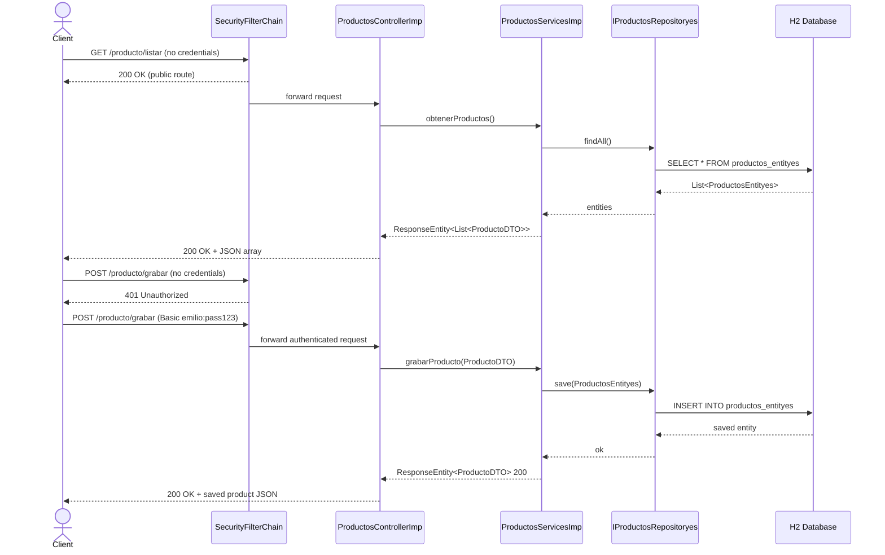

# BasicSecurity — Spring Boot 3 + Spring Security (HTTP Basic)


A hands-on learning microservice that demonstrates how to secure a REST API using **Spring Security 6** with **HTTP Basic Authentication** on top of **Spring Boot 3.4.5 / Java 21**. It exposes a full CRUD for a `Producto` (Product) resource, enforces route-level access control, and seeds an in-memory H2 database on startup — no external infrastructure required.

---

## Tech Stack & Infrastructure

- **Java 21** — LTS, virtual-thread ready
- **Spring Boot 3.4.5** — auto-configuration, embedded Tomcat
- **Spring Security 6** — `SecurityFilterChain` bean (lambda DSL), HTTP Basic Auth, CSRF disabled for stateless REST
- **Spring Data JPA + Hibernate** — ORM layer; `ddl-auto: create-drop` (schema recreated on every boot — intentional for a learning project)
- **H2 In-Memory Database** — `jdbc:h2:mem:testdb`; web console enabled at `/h2-console`
- **Lombok** — boilerplate reduction (`@Data`, `@Slf4j`, etc.)
- **Bean Validation (Jakarta)** — `@NotBlank`, `@Min`, `@DecimalMin` on the DTO layer
- **Logback** — custom console pattern with colour-coded log levels
- **Maven Wrapper** — reproducible builds without a local Maven installation
- **No Docker / No CI/CD pipeline** — see [DevOps & CI/CD](#devops--cicd-pipeline) for recommended improvements

---

## Architecture / System Flow

```
HTTP Client (Postman / curl)
        │
        ▼
┌──────────────────────────────────────────────────────┐
│  Spring Security Filter Chain (SeguridadBasicaConfig) │
│  • /h2-console/**          → permitAll               │
│  • GET /producto/**        → permitAll               │
│  • POST /producto/**       → authenticated           │
│  • anyRequest              → authenticated           │
│  • HTTP Basic Auth         → in-memory user (emilio) │
└──────────────────────────────────────────────────────┘
        │
        ▼
┌─────────────────────────┐
│  ProductosControllerImp │  implements IProductosController
│  (@RestController)      │
└────────────┬────────────┘
             │ delegates to
             ▼
┌─────────────────────────┐
│  ProductosServicesImp   │  implements IProductosServices
│  (@Service)             │
└────────────┬────────────┘
             │ uses
             ▼
┌─────────────────────────┐     ┌──────────────────────┐
│  IProductosRepositoryes │────▶│  H2 In-Memory DB     │
│  (JpaRepository)        │     │  ProductosEntityes   │
└─────────────────────────┘     └──────────────────────┘
             ▲
             │ seeded by
┌─────────────────────────┐
│  Cargainicial           │  CommandLineRunner — 5 products on startup
│  (@Component)           │
└─────────────────────────┘
```

### Request Sequence Diagram



---

## Prerequisites & Installation

### Requirements

| Tool | Version |
|------|---------|
| JDK  | 21+     |
| Maven | 3.9+ (or use `./mvnw`) |

### Run locally

```bash
# 1. Clone the repository
git clone https://github.com/jaimeemi/BasicSecurity.git
cd BasicSecurity

# 2. Build and run
./mvnw spring-boot:run
```

The application starts on **port 8085**.

### Default credentials (application.yml)

| Property | Value |
|----------|-------|
| Username | `emilio` |
| Password | `pass123` |
| DB URL   | `jdbc:h2:mem:testdb` |
| DB User  | `sa` |
| DB Pass  | *(empty)* |

### H2 Console

Navigate to `http://localhost:8085/h2-console` — no login required.
Use the JDBC URL `jdbc:h2:mem:testdb` with user `sa` and an empty password.

---

## Core Features & Endpoints

Base URL: `http://localhost:8085`

| Method | Path | Auth Required | Description |
|--------|------|:---:|-------------|
| `GET` | `/producto/{productoId}` | No | Retrieve a single product by ID |
| `GET` | `/producto/listar` | No | List all products |
| `POST` | `/producto/grabar` | **Yes** | Create a new product |
| `PUT` | `/producto/actualizar/{productoId}` | **Yes** | Update an existing product |
| `DELETE` | `/producto/eliminar/{productoId}` | **Yes** | Delete a product by ID |

### Sample request — create a product

```bash
curl -X POST http://localhost:8085/producto/grabar \
  -u emilio:pass123 \
  -H "Content-Type: application/json" \
  -d '{
    "nombre": "Webcam HD",
    "descripcion": "Cámara para videollamadas",
    "stock": 12,
    "precio": 75.0
  }'
```

### ProductoDTO validation rules

| Field | Constraint |
|-------|-----------|
| `nombre` | `@NotBlank` |
| `descripcion` | `@NotBlank` |
| `stock` | `@Min(1)` |
| `precio` | `@DecimalMin("0.01")` |

Validation errors return `400 Bad Request` with a field-error map handled by `ManejadorGlobalExcepciones`.

---

## DevOps & CI/CD Pipeline

No CI/CD pipeline or containerization is currently configured. The following improvements are recommended for a production-grade setup:

### Suggested GitHub Actions pipeline (`.github/workflows/ci.yml`)

```yaml
name: CI
on: [push, pull_request]
jobs:
  build:
    runs-on: ubuntu-latest
    steps:
      - uses: actions/checkout@v4
      - uses: actions/setup-java@v4
        with:
          java-version: '21'
          distribution: 'temurin'
      - run: ./mvnw verify
      - name: Build & push Docker image
        uses: docker/build-push-action@v5
        with:
          push: ${{ github.ref == 'refs/heads/main' }}
          tags: ghcr.io/jaimeemi/basic-security:latest
```

### Suggested Dockerfile

```dockerfile
FROM eclipse-temurin:21-jre-alpine
WORKDIR /app
COPY target/security-0.0.1-SNAPSHOT.jar app.jar
EXPOSE 8085
ENTRYPOINT ["java", "-jar", "app.jar"]
```

### Additional recommended improvements

| Area | Recommendation |
|------|---------------|
| Database | Replace H2 + `create-drop` with PostgreSQL + **Flyway** migrations for persistence |
| Auth | Upgrade from HTTP Basic to **JWT / OAuth2** for stateless token-based auth |
| API Docs | Uncomment and configure **SpringDoc OpenAPI** (already in `pom.xml`) |
| Observability | Add **Spring Boot Actuator** + **Micrometer** + Prometheus/Grafana |
| Containerization | Add `docker-compose.yml` with app + PostgreSQL services |
| Kubernetes | Deploy via Helm chart with `HorizontalPodAutoscaler` for scalability |
| Secret management | Externalize credentials via **AWS Secrets Manager** or Kubernetes Secrets |

---

## Project Structure

```
src/main/java/com/security/
├── SecurityApplication.java          # Entry point
├── components/
│   └── Cargainicial.java             # CommandLineRunner — seeds 5 products
├── config/
│   └── SeguridadBasicaConfig.java    # SecurityFilterChain definition
├── controller/
│   ├── IProductosController.java     # REST interface with @RequestMapping
│   └── imp/ProductosControllerImp.java
├── exceptions/
│   └── ManejadorGlobalExcepciones.java  # @RestControllerAdvice
├── models/
│   ├── DTO/ProductoDTO.java
│   └── entities/ProductosEntityes.java
├── respositorys/
│   ├── IProductosRepositoryes.java   # JpaRepository<ProductosEntityes, Integer>
│   └── functions/RepositoriesFunctions.java  # Manual entity↔DTO mapping
└── service/
    ├── IProductosServices.java
    └── imp/ProductosServicesImp.java
```

---

## Author

**Emilio** — [@jaimeemi](https://github.com/jaimeemi)
